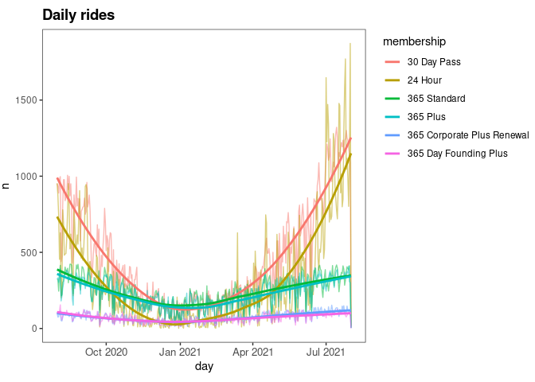

Analysis: Vancouver’s *Mobi* Bike Share
================
Andrew Luyt
<br>Last updated Thursday December 09, 2021

-   [All stations](#all-stations)
-   [TODO: motion vectors & volume for interesting membership
    types](#todo-motion-vectors--volume-for-interesting-membership-types)
-   [TODO: separate weekday & weekend](#todo-separate-weekday--weekend)
-   [TODO: animate short vs long
    rides](#todo-animate-short-vs-long-rides)
-   [TODO: animate all individual rides as thin
    arrows.](#todo-animate-all-individual-rides-as-thin-arrows)
-   [TODO: separate weekday &
    weekend](#todo-separate-weekday--weekend-1)
-   [TODO: combine volume and direction in one
    animation?](#todo-combine-volume-and-direction-in-one-animation)
-   [TODO](#todo-1)

``` r
library(tidyverse)
library(lubridate)
library(sf)         # Vancouver map
library(gganimate)
library(viridis)

source("mobi_functions.R")

RIDES = "data/mobi_rides.Rdata"
if(file.exists(RIDES)) {
  load(RIDES)
  df <- as_tibble(df) %>% 
    mutate(hour = hour(depart_time))
} else {
  stop("Please run clean_data.R to create the required data")
}

MAP = "data/vancouver_map.geojson"
if(file.exists(MAP)) {
  MAP <- st_read(MAP)
} else {
  stop("Please run clean_data.R to create the required data")
}

STANLEY_PARK = "data/parks-polygon-representation.geojson"
if(file.exists(STANLEY_PARK)) {
  STANLEY_PARK <- st_read(STANLEY_PARK)
  STANLEY_PARK <- STANLEY_PARK %>% filter(park_name == 'Stanley Park')
}

rm(RIDES)

# Helper function for vectors
angle_from_x_axis <- function(y,x) {
  angle <- atan2(y, x)
  if (y<0) {
    angle <- angle + 2 * pi
  }
  angle * 180 / pi
}
```

Hierarchical clustering of features suggests `trip_distance` is a
feature very different from the others. `bike` is an ID for a specific
bike.

<!-- -->

For fun, create principal components and plot the first three to see if
rides are easily seperable. PC3 will be used for colouring. We see the
hints of some structure, with rides separating into two overlapping
groups. It’s worth noting that PC1 - PC3 account for only 45% of
variation, so much more separation is possible.

    ## Importance of components:
    ##                           PC1    PC2    PC3     PC4     PC5     PC6     PC7
    ## Standard deviation     1.5656 1.3453 1.2437 1.11666 1.04598 1.01958 0.99752
    ## Proportion of Variance 0.1885 0.1392 0.1190 0.09592 0.08416 0.07996 0.07654
    ## Cumulative Proportion  0.1885 0.3278 0.4468 0.54269 0.62685 0.70682 0.78336
    ##                            PC8     PC9    PC10    PC11      PC12      PC13
    ## Standard deviation     0.98632 0.92405 0.80733 0.58128 0.0001288 6.968e-07
    ## Proportion of Variance 0.07483 0.06568 0.05014 0.02599 0.0000000 0.000e+00
    ## Cumulative Proportion  0.85819 0.92387 0.97401 1.00000 1.0000000 1.000e+00

<!-- --><!-- -->

Similar to what we did with hierarchical clustering, plotting principal
components for *features* again suggests that `trip_distance` and `bike`
are particularly different features, while the others tend to group
together. It’s worth recalling we skipped the categorical features
rather than trying to find a useful encoding scheme for them.

    ## Importance of components:
    ##                             PC1     PC2      PC3     PC4     PC5     PC6
    ## Standard deviation     130.3481 53.4972 11.84312 2.58239 0.46123 0.38652
    ## Proportion of Variance   0.8495  0.1431  0.00701 0.00033 0.00001 0.00001
    ## Cumulative Proportion    0.8495  0.9926  0.99964 0.99998 0.99999 0.99999
    ##                            PC7   PC8     PC9    PC10      PC11      PC12
    ## Standard deviation     0.33104 0.083 0.04799 0.01256 7.642e-06 8.623e-08
    ## Proportion of Variance 0.00001 0.000 0.00000 0.00000 0.000e+00 0.000e+00
    ## Cumulative Proportion  1.00000 1.000 1.00000 1.00000 1.000e+00 1.000e+00
    ##                             PC13
    ## Standard deviation     1.867e-14
    ## Proportion of Variance 0.000e+00
    ## Cumulative Proportion  1.000e+00

<!-- -->

    ## # A tibble: 20 × 2
    ##    membership                     most_recent_use    
    ##    <fct>                          <dttm>             
    ##  1 Shared Mobility Pass           2020-08-31 18:00:00
    ##  2 Archived Monthly Basic         2020-09-22 15:00:00
    ##  3 90 Day                         2020-11-10 16:00:00
    ##  4 Vancity Community Pass         2020-12-31 22:00:00
    ##  5 365 Corporate Plus             2021-07-31 21:00:00
    ##  6 365 Day Founding Standard      2021-07-31 21:00:00
    ##  7 Archived Monthly Plus          2021-07-31 22:00:00
    ##  8 365 Corporate Standard         2021-07-31 23:00:00
    ##  9 365 Day Pass Plus SALE         2021-07-31 23:00:00
    ## 10 Archived Monthly Standard      2021-07-31 23:00:00
    ## 11 VIP                            2021-07-31 23:00:00
    ## 12 Community Pass                 2021-07-31 23:00:00
    ## 13 24 Hour                        2021-08-01 00:00:00
    ## 14 30 Day Pass                    2021-08-01 00:00:00
    ## 15 365 Corporate Plus Renewal     2021-08-01 00:00:00
    ## 16 365 Corporate Standard Renewal 2021-08-01 00:00:00
    ## 17 365 Day Founding Plus          2021-08-01 00:00:00
    ## 18 365 Plus                       2021-08-01 00:00:00
    ## 19 365 Standard                   2021-08-01 00:00:00
    ## 20 365 Day Pass Standard SALE     2021-08-01 00:00:00

So the first four seem to be no longer used in the system.

<!-- -->

There are 20 membership types listed, but on the
[https://www.mobibikes.ca/en/offers-subscription](webpage), only 6 are
listed. The others seem to be grandfathered in, or special offers that
aren’t generally available. We’ll limit our analysis to a subset of the
most popular memberships. Two of these popular memberships, the
**Community Pass** and **365 Day Founding Plus** are not currently
listed as available.

    ## `geom_smooth()` using method = 'loess' and formula 'y ~ x'

<!-- -->

The 30 day and 24 hour passes are the most popular. The 365 passes seem
to be bought by those who don’t mind riding in winter, as their is much
less seasonal variation in rides for those members.

Particularly in summer there’s a lot of daily variation in rides.

### TODO

Is it from rain or what? You could get rainfall data (downtown
vancouver, not the airport?) and plot/corr mm of rain with n\_rides.

<!-- -->
Weekends are really popular for 24-hour passes. The 365 passes are
**more** popular during the **week**, suggesting they might be being
used for commuting.

<!-- -->

    ## `summarise()` has grouped output by 'hour'. You can override using the `.groups` argument.

<!-- --><!-- --><!-- --><!-- -->

-   24 hour passes have the longest rides (in time and distance)
-   The 365 passes (especially Founding Plus) have more stopovers per
    trip
    -   and also longer stopovers on average

<!-- -->

    ## `summarise()` has grouped output by 'weekday'. You can override using the `.groups` argument.

<!-- --><!-- --><!-- --><!-- --><!-- -->

-   Trip durations and distances are very steady throughout the week
-   24 hour pass holders ride the slowest.
    -   We noted above they also ride the longest duration and most
        distance.

The **365 Day Founding Plus** pass is a real outlier. It has many times
more stopovers per ride than any other type of pass.

### Stopovers?

Mobi bikes offer a
[https://www.mobibikes.ca/en/news/make-quick-stop-stopover-mode](stopover%20mode)
where the bike’s steering column locks and the integrated lock can be
accessed. It is meant as a convenience when you need to stop somewhere
that doesn’t have a Mobi docking station, like a grocery store. The ride
timer doesn’t stop and most Mobi memberships offer a maximum of 30
minutes of use before overage fees start, so it would be interesting to
see what kinds of members have these stopovers on their trips. Let’s
graph rides by the number of stopovers taken then colour by the
membership type.

<!-- -->

As a first observation we see clearly that most people are taking a
bike, riding immediately to a desination and then docking the bike. Only
a comparative few stop somewhere along the way. Let’s examine *only*
those trips with at least 1 stopover.

<!-- -->

Rides with one stopover have a broad distribution of memberships. How
about 2 or more stopovers?

<!-- -->

It looks like **365 Plus** and **365 Founding Plus** are the types of
memberships used for trips with a few stopovers. Let’s draw a graph of
*proportions* of rides, rather than total number of rides.

<!-- -->

**365 Day Founding Plus** members make up most of the users that stop at
a location during their ride. **365 Day Plus** is in second place. These
both offer a notable clause in their
[https://www.mobibikes.ca/en/terms-and-conditions-use](agreements.) Most
memberships offer 30 minutes of riding, after which overage fees begin,
but these two passes offer **60 minutes**. If a person intends to use
the bike system for running errands, going somewhere for lunch, or other
purposes which require more time than a simple A to B trip, these passes
offer the best value by avoiding overage fees.

On the [https://www.mobibikes.ca/en/offers-subscription](offers%20page)
however we don’t see the **365 Day Founding Plus** pass for sale,
suggesting it is some sort of special offer not generally available to
the public. People who hold this pass have notably more stopovers per
trip than any other membership, suggesting that whomever has one makes
good use of it.

The 365 Plus pass **is** available for sale, explaining its apparent
popularity with people who regularly need more time on their rides.

Let’s look deeper into these *founding plus* members - are there any
notable geographic patterns?

    ## `summarise()` has grouped output by 'hour'. You can override using the `.groups` argument.

<!-- -->

for 365 plus/founding, the animation wasn’t insightful. The trends were
very weak.

## All stations

All traffic departing from / arriving at stations, averaged out.

    ## `summarise()` has grouped output by 'hour'. You can override using the `.groups` argument.

The easternmost station in Stanley Park with the huge westward signal is
station 105, “Stanley Park - Totem Poles”. This probably represents
people riding the seawall in the legal direction and dropping off their
bike at the Second Beach station at the west side of the park.

    ## `summarise()` has grouped output by 'hour'. You can override using the `.groups` argument.

<!-- -->

Most 60-minute-limit traffic averages out to traveling in to downtown,
centered on the districts east of Granville Street. Later, we’ll examine
all bike traffic and see it shows a similar pattern.

In
[https://andrewluyt.github.io/divvy-bikeshare/](a%20previous%20analysis%20of%20the%20Divvy%20bikeshare)
in Chicago, I found similar bike traffic: most traffic flowed from the
outlying districts towards a central core of high activity.

    ## `summarise()` has grouped output by 'hour'. You can override using the `.groups` argument.

<!-- --><!-- --><!-- --><!-- -->

    ## `summarise()` has grouped output by 'weekday'. You can override using the `.groups` argument.

<!-- --><!-- --><!-- --><!-- -->

## TODO: motion vectors & volume for interesting membership types

<!-- -->

    ## `summarise()` has grouped output by 'membership'. You can override using the `.groups` argument.

<!-- -->

## TODO: separate weekday & weekend

## TODO: animate short vs long rides

## TODO: animate all individual rides as thin arrows.

might have to limit to a day, or an hour in one day.

    ## `summarise()` has grouped output by 'hour'. You can override using the `.groups` argument.

<!-- -->

    ## `summarise()` has grouped output by 'hour'. You can override using the `.groups` argument.

## TODO: separate weekday & weekend

## TODO: combine volume and direction in one animation?

<!-- -->

## TODO

color or facet by membership, etc

use a different type of map like the watercolor tiles so you can get a
cool look?

<!-- --><!-- --><!-- -->

    ## Warning: Removed 5704 rows containing non-finite values (stat_bin).

    ## Warning: Removed 2 rows containing missing values (geom_bar).

<!-- --><!-- -->

<!-- -->
